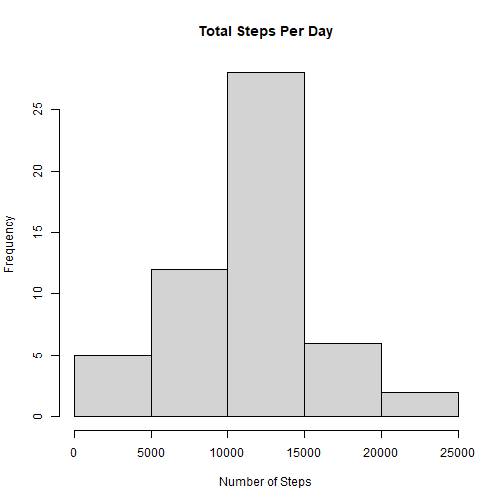
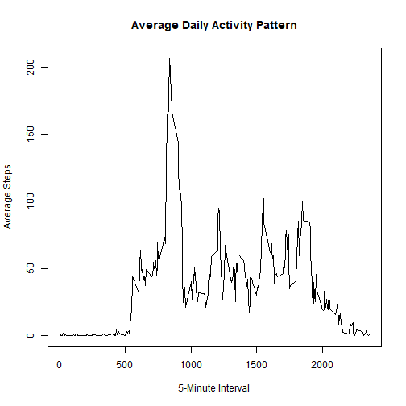
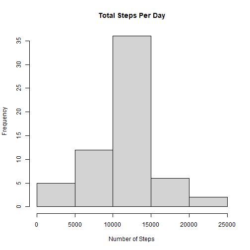
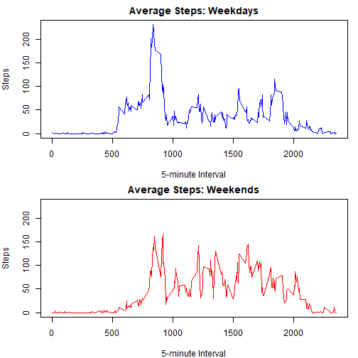

## Introduction

It is now possible to collect a large amount of data about personal movement
using activity monitoring devices such as a Fitbit, Nike Fuelband, or Jawbone
Up. These type of devices are part of the “quantified self” movement – a group
of enthusiasts who take measurements about themselves regularly to improve
their health, to find patterns in their behavior, or because they are tech geeks.
But these data remain under-utilized both because the raw data are hard to
obtain and there is a lack of statistical methods and software for processing and
interpreting the data.

This document made use of data from a personal activity monitoring device.
This device collects data at 5 minute intervals through out the day. The data
consists of two months of data from an anonymous individual collected during
the months of October and November, 2012 and include the number of steps
taken in 5 minute intervals each day.

## Data

The data for this assignment was downloaded from the course web site:

- **Dataset**: [Activity Monitoring Data (58k)][1]

[1]: https://d396qusza40orc.cloudfront.net/repdata%2Fdata%2Factivity.zip "Activity Monitoring Data (58k)"
      
The variables included in this dataset are:

- **steps**: Number of steps taking in a 5-minute interval (missing values are
coded as NA)

- **date**: The date on which the measurement was taken in YYYY-MM-DD
format

- **interval**: Identifier for the 5-minute interval in which measurement was
taken
      
The dataset is stored in a comma-separated-value (CSV) file and there are a
total of 17,568 observations in this dataset.

## Assignment
### Loading and preprocessing the data


``` r
# Loading the data file 
act_data <- read.csv("activity.csv",header=TRUE)

# Transform the date column
library(lubridate)
act_data$date <- ymd(act_data$date)

# Check the result
str(act_data$date)
```

```
##  Date[1:17568], format: "2012-10-01" "2012-10-01" "2012-10-01" "2012-10-01" "2012-10-01" "2012-10-01" "2012-10-01" "2012-10-01" "2012-10-01" ...
```

### What is the mean total number of steps taken per day?


``` r
#Sums by date
daily_steps <- aggregate(steps ~ date, act_data, sum, na.rm=TRUE)

# Check the result
head(daily_steps)
```

```
##         date steps
## 1 2012-10-02   126
## 2 2012-10-03 11352
## 3 2012-10-04 12116
## 4 2012-10-05 13294
## 5 2012-10-06 15420
## 6 2012-10-07 11015
```

``` r
# Plot histogram
hist(daily_steps$steps,
     main = "Total Steps Per Day",
     xlab = "Number of Steps")
```

<div class="figure" style="text-align: center">

<p class="caption">Figure 1: Histogram of the total number of steps taken each day</p>
</div>

``` r
# Supress scientific notation for inline computations to come
options(scipen = 999)
```

The mean total number of steps taken per day is **10766** and the median is **10765**.

### What is the average daily activity pattern?


``` r
# Calculate average steps per interval across all days
interval_data <- aggregate(steps ~ interval, act_data, mean, na.rm = TRUE)

# The plot function needs: x-variable, y-variable, and then the type
plot(interval_data$interval, interval_data$steps, 
     type = "l", 
     main = "Average Daily Activity Pattern",
     xlab = "5-Minute Interval",
     ylab = "Average Steps")
```



The 5-minute interval that, on average, contains the maximum number of steps is **835**.

### Imputing missing values


``` r
total_na <- sum(is.na(act_data$steps))
print(total_na)
```

```
## [1] 2304
```

``` r
all_na <- sum(is.na(act_data))
print(all_na)
```

```
## [1] 2304
```
The number of NAs in the column steps (2304) is equal to the number of all NAs in the dataset.
Therefore, we are only concerned about the steps column for imputation.


``` r
# Make a copy of the original dataset 
act_imputed <- act_data

# Loop through using the match function replace NAs with that interval's mean.
for (i in 1:nrow(act_imputed)) {
    if (is.na(act_imputed$steps[i])) {
        # Find the average for this specific interval
        avg_val <- interval_data$steps[which(interval_data$interval == act_imputed$interval[i])]
        # Replace the NA with that average
        act_imputed$steps[i] <- avg_val
    }
}

# Check for any NAs left
sum(is.na(act_imputed$steps))
```

```
## [1] 0
```

Every row now has a value for the number of steps on every interval for every date. Will this change the analysis above? Let's check.


``` r
#Sums by date
imputed_steps <- aggregate(steps ~ date, act_imputed, sum, na.rm=TRUE)

# Check the result
head(imputed_steps)
```

```
##         date    steps
## 1 2012-10-01 10766.19
## 2 2012-10-02   126.00
## 3 2012-10-03 11352.00
## 4 2012-10-04 12116.00
## 5 2012-10-05 13294.00
## 6 2012-10-06 15420.00
```

``` r
# Plot histogram
hist(imputed_steps$steps,
     main = "Total Steps Per Day",
     xlab = "Number of Steps")
```

<div class="figure" style="text-align: center">

<p class="caption">Figure 2: Histogram of the total number of steps taken each day (with imputed values</p>
</div>

The mean total number of steps taken per day is **10766** and the median is **10766.1886792**. The rounded mean is the same and median has increased by about one. Imputation has not made a meaningful difference in the analysis.

### Are there differences in activity patterns between weekdays and weekends?


``` r
# Ensure date is actually a Date object
act_imputed$date <- as.Date(act_imputed$date)

# Create the day names
act_imputed$day_of_week <- weekdays(act_imputed$date)

# Create the categorical 'day_type'
act_imputed$day_type <- ifelse(
  act_imputed$day_of_week %in% c("Saturday", "Sunday"), 
  "weekend", 
  "weekday"
)

# Convert to factor
act_imputed$day_type <- as.factor(act_imputed$day_type)

# Check altered dataset
head(act_imputed)
```

```
##       steps       date interval day_of_week day_type
## 1 1.7169811 2012-10-01        0      Monday  weekday
## 2 0.3396226 2012-10-01        5      Monday  weekday
## 3 0.1320755 2012-10-01       10      Monday  weekday
## 4 0.1509434 2012-10-01       15      Monday  weekday
## 5 0.0754717 2012-10-01       20      Monday  weekday
## 6 2.0943396 2012-10-01       25      Monday  weekday
```

Successful addition of the variables "day_of_week" and "the new column"day_type". With these additions, we can now compare the activity on weekdays and on weekends.


``` r
# Aggregate average steps per interval across day_type
avg_steps_type <- aggregate(steps ~ interval + day_type, 
                            data = act_imputed, 
                            FUN = mean)

# Subset into two dataframes
weekday_data <- subset(avg_steps_type, day_type == "weekday")
weekend_data <- subset(avg_steps_type, day_type == "weekend")

# Find the maximum Y value to keep the scales the same
max_y <- max(avg_steps_type$steps)

# Set layout for 2 rows, 1 column
par(mfrow = c(2, 1), mar = c(4, 4, 2, 1))

# Top Plot: Weekday
plot(weekday_data$interval, weekday_data$steps, 
     type = "l", col = "blue",
     main = "Average Steps: Weekdays",
     xlab = "5-minute Interval", ylab = "Steps",
     ylim = c(0, max_y))

# Bottom Plot: Weekend
plot(weekend_data$interval, weekend_data$steps, 
     type = "l", col = "red",
     main = "Average Steps: Weekends",
     xlab = "5-minute Interval", ylab = "Steps",
     ylim = c(0, max_y))
```

<div class="figure" style="text-align: center">

<p class="caption">Figure 3: Panel plot - average steps taken (weekdays v. weekends)</p>
</div>
